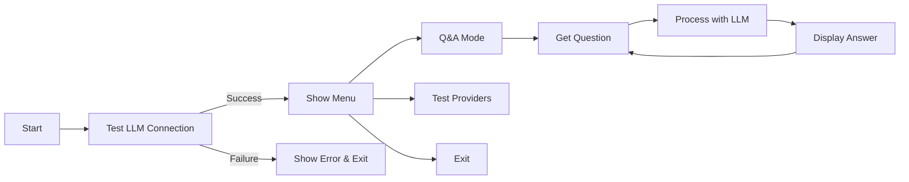

# Project Design Document

## Overview
This LLM project follows the Agentic Coding principles and PocketFlow framework structure. It provides a flexible, multi-provider LLM interface with a beautiful terminal UI.

## Requirements
- Support multiple LLM providers (OpenAI, Anthropic)
- Provide a clean, user-friendly CLI interface
- Automatic environment configuration
- Comprehensive error handling and logging
- Extensible architecture for future enhancements

## Flow Design
The application follows a simple Q&A flow pattern:

## Utilities

### 1. **call_llm** (`utils/call_llm.py`)
- **Input**: `str` (prompt), optional provider and parameters
- **Output**: `str` (LLM response)
- **Necessity**: Core function for LLM interaction
- **Features**:
  - Multi-provider support (OpenAI, Anthropic)
  - Automatic .env loading
  - Error handling and retry logic
  - Configurable parameters (temperature, max_tokens)
  - Chat history support

### 2. **search_web** (`utils/search_web.py`)
- **Input**: `str` (search query)
- **Output**: `str` (search results)
- **Necessity**: Optional utility for web search integration
- **Status**: Template implementation, requires actual API integration

## Node Design

### GetQuestionNode
- **Type**: Regular
- **prep**: No data needed from shared store
- **exec**: Get user input via terminal
- **post**: Write question to shared["question"]

### AnswerNode
- **Type**: Regular
- **prep**: Read question from shared["question"]
- **exec**: Call LLM utility function with the question
- **post**: Write answer to shared["answer"]

## Terminal UI Design

The CLI interface implements a modern, colorful design:

### Color Scheme
- **Headers**: Purple/Magenta with cyan borders
- **Success**: Green with checkmark (✓)
- **Errors**: Red with X mark (❌)
- **Info**: Blue with info icon (ℹ)
- **Prompts**: Yellow with arrow (▶)
- **Content**: Default with cyan dividers

### Features
1. Clear screen navigation
2. Styled headers and dividers
3. Interactive menu system
4. Color-coded messages
5. Progress indicators

## Implementation Notes

### Architecture Decisions
1. **Provider Abstraction**: Generic `call_llm` function with provider-specific implementations
2. **Environment-based Config**: All secrets in .env file
3. **Direct LLM Mode**: Bypasses PocketFlow for simpler implementation
4. **Modular Design**: Easy to add new providers or features

### Error Handling
- Clear error messages with actionable suggestions
- Graceful fallbacks for missing dependencies
- Comprehensive logging for debugging

### Security Considerations
- API keys stored in .env (gitignored)
- No hardcoded secrets
- Input validation for user prompts

## Future Enhancements

1. **Flow Integration**: Fully implement PocketFlow when available
2. **Persistence**: Save conversation history
3. **Streaming**: Support streaming responses
4. **Web Interface**: Add Flask/FastAPI web UI
5. **More Providers**: Google, Azure, local models
6. **Advanced Features**: RAG, agents, tool use

## Testing Strategy

1. **Unit Tests**: For individual utilities
2. **Integration Tests**: Provider connections
3. **UI Tests**: Terminal interaction flows
4. **Load Tests**: Rate limiting and performance

## Deployment Considerations

1. **Dependencies**: Minimal external requirements
2. **Configuration**: Environment-based
3. **Platform**: Cross-platform (Windows, Mac, Linux)
4. **Distribution**: pip installable package